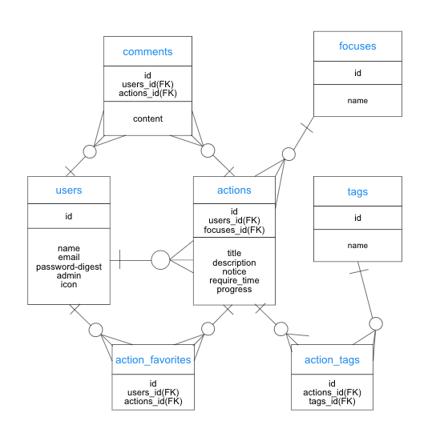

# アプリ名：my_confidence

## アプリ概要

自分自身の日々の活動記録を記述することができるサイトです。
自分自身の活動記録を記述することで、「自分はこれだけ頑張った！」ということを実感してもらい
自分自身に裏付けのある自信を持ってもらうためのサイトです。
日々の活動記録をつけたくなるような機能の搭載を目指しています。

## バージョン

* ruby 2.6.3
* rails 5.2.3

## カタログ設計

<https://docs.google.com/spreadsheets/d/1PWTXyaOHQNR8c3mVfnO9akgOYq46YU_Pztu1CDlhiRU/edit#gid=204658318>

## テーブル設計

<https://docs.google.com/spreadsheets/d/1PWTXyaOHQNR8c3mVfnO9akgOYq46YU_Pztu1CDlhiRU/edit#gid=478804872>
## ER図

<https://cacoo.com/diagrams/gUPkC2Yf8GAEMVl8/2B4F4?reload_rt=1567599855582_0>
## 画面遷移図

<https://cacoo.com/diagrams/gUPkC2Yf8GAEMVl8/25FBB?reload_rt=1567599855582_0>
## ワイヤーフレームワーク

<https://cacoo.com/diagrams/gUPkC2Yf8GAEMVl8/51CCE?reload_rt=1567599855582_0>
## 使用予定のGem

* devise

* carrierwave

* mini_magick

* kaminari

* simple_calendar

* rspec-rails

* faker

* fog-aws

* dotenv-rails

* bootstrap

* jquery-rails

* ransack
