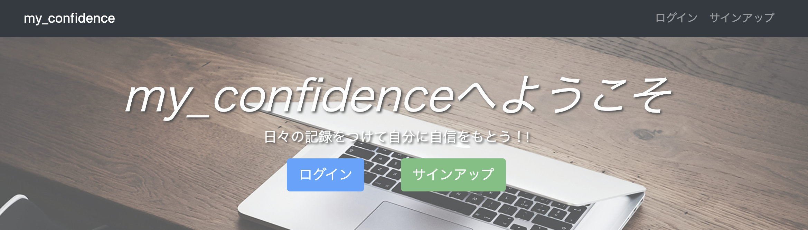
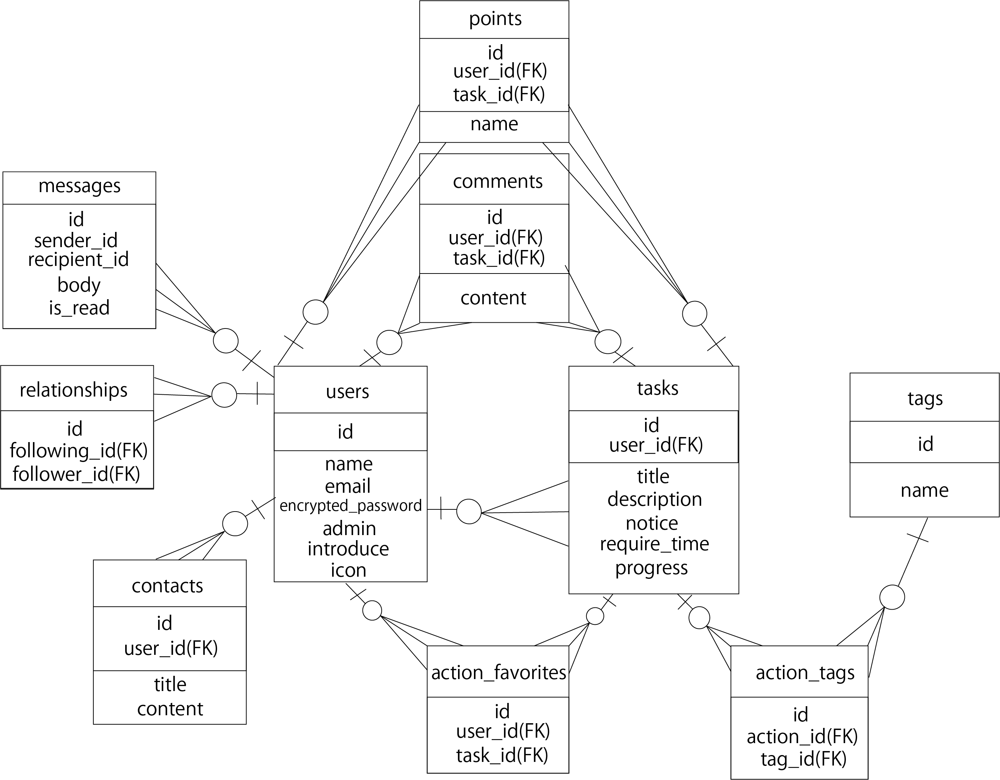

# アプリ名：my_confidence

## アプリ概要

自分自身の日々の活動記録を記述することができるサイトです。
自分自身の活動記録を記述することで、「自分はこれだけ頑張った！」ということを実感してもらい
自分自身に裏付けのある自信を持ってもらうためのサイトです。
日々の活動記録をつけることができます。

## バージョン

  

## 機能一覧
- ログイン・ユーザー登録を搭載
   - 名前、メールアドレス、パスワードは必須
   - プロフィール編集機能
   - プロフィール画像をアイコンとして設定ができる

- コメント機能
   - 投稿に対して他のユーザーがコメントできる。Ajaxを活用。

- お気に入り機能
   - 投稿内容に対して「いいね」をつけることができる。

- メッセージ機能
   - 気に入ったユーザーがいればメッセージを送ることができる。

- 投稿検索機能
   - 過去の投稿内容に対し文字列・日付で検索することができます。

- 管理者権限機能
   - 他のユーザーの投稿やコメント削除を行うことができる。

- トップページはカレンダー形式で表示
   -　カレンダー形式によっていつ投稿したか見つけやすくなる。

## カタログ設計

<https://docs.google.com/spreadsheets/d/1PWTXyaOHQNR8c3mVfnO9akgOYq46YU_Pztu1CDlhiRU/edit#gid=204658318>

## テーブル設計

<https://docs.google.com/spreadsheets/d/1PWTXyaOHQNR8c3mVfnO9akgOYq46YU_Pztu1CDlhiRU/edit#gid=478804872>
## ER図

<https://docs.google.com/spreadsheets/d/1PWTXyaOHQNR8c3mVfnO9akgOYq46YU_Pztu1CDlhiRU/edit#gid=1406161042>
## 画面遷移図

<https://docs.google.com/spreadsheets/d/1PWTXyaOHQNR8c3mVfnO9akgOYq46YU_Pztu1CDlhiRU/edit#gid=1950864807>
## ワイヤーフレームワーク

<https://docs.google.com/spreadsheets/d/1PWTXyaOHQNR8c3mVfnO9akgOYq46YU_Pztu1CDlhiRU/edit#gid=1985858776>

## 使用Gem
- bootstrap # 画面デザイン
- cancancan # 管理者画面の権限
- carrierwave # 画像投稿
- devise # ログイン機能
- dotenv-rails # 環境変数管理
- fog-aws # AWS S3
- font-awesome-sass # icon
- kaminari # ページネーション
- mini_magick # 画像のリサイズ
- ransack # ソート機能
- rails_admin # 管理者画面
- rails_autolink # 投稿内容にリンクを貼ることができる
- simple_calendar # カレンダー表示

## 導入準備

* $ git clone git@github.com:t-kawaka/my_confidence.git
* $ cd my_confidence
* $ bundle install
* $ rails db:create db:migrate
* $ rails db:seed_fu

- fakerを使用しているため、seed_fuを行う際は、application.rbにある下記２行のコメントアウトをお願いします。
   - I18n.config.available_locales = :ja
   - I18n.default_locale = :ja
